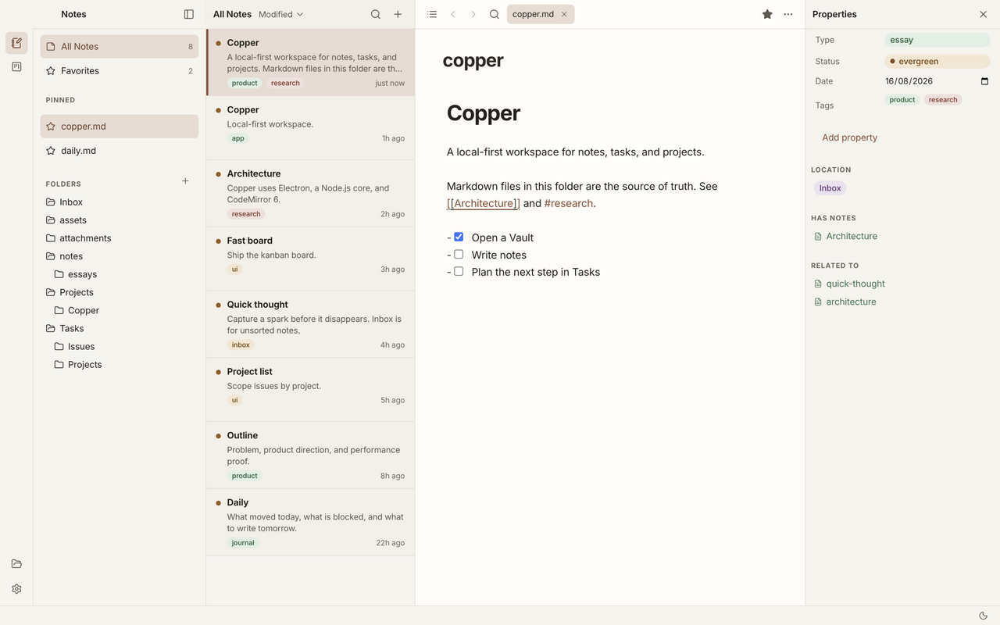
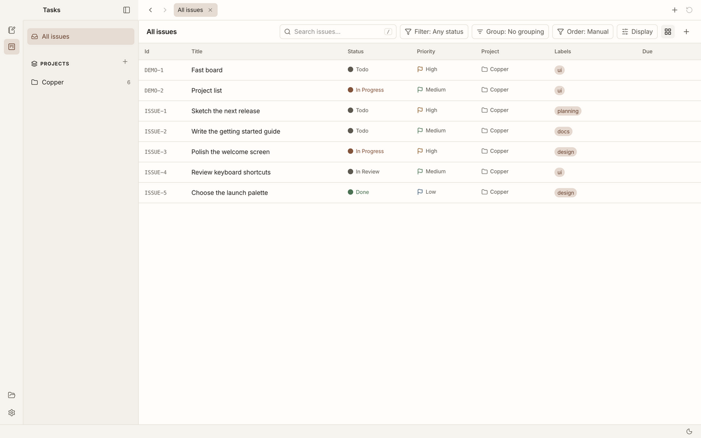
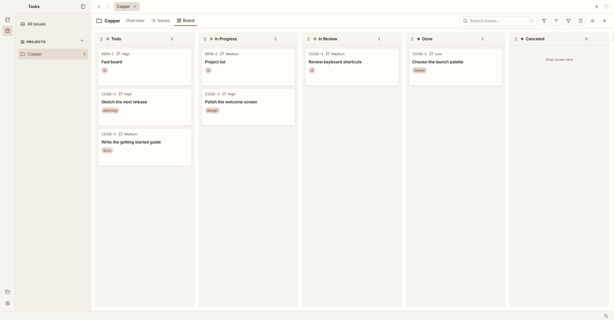
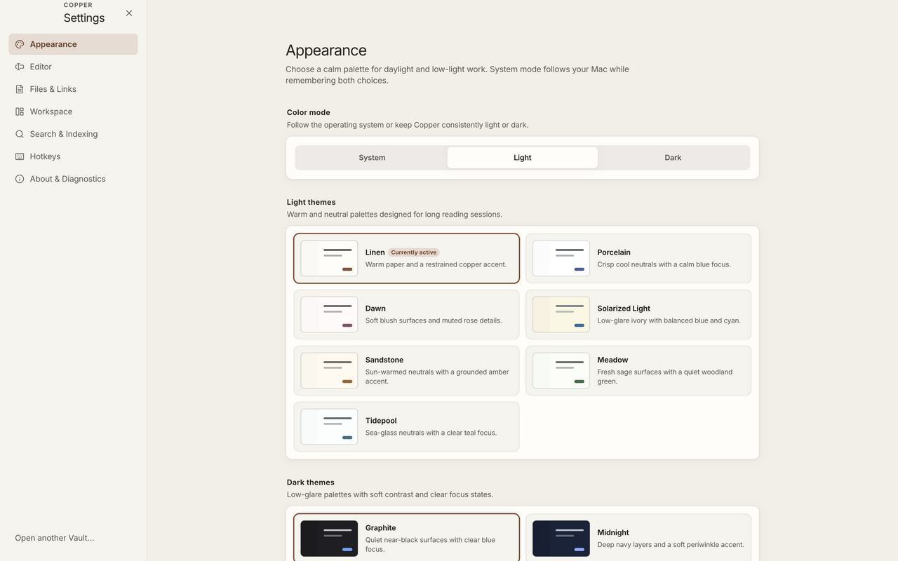

# Copper

A local-first workspace for notes, tasks, and projects.

**Website: [copper.potion.sh](https://copper.potion.sh)**

Copper brings **Notes** and **Tasks** into one desktop workspace. A **Vault** is
any folder you choose. Notes, projects, and issues are Markdown files in that
folder. There is no account and no cloud. The SQLite search index lives in app data, not inside your notes.



*Browse notes, edit Markdown, and manage properties in one workspace.*



*Plan work in Tasks: find issues, set priorities, and keep projects close at hand.*



*Switch between project overview, issue list, and board. Move cards as work progresses.*



*Choose light and dark palettes, or follow your system appearance.*

## Prerequisites

- [Node.js](https://nodejs.org/) 22.14 or newer (current LTS)
- [pnpm](https://pnpm.io/) 11.22 or newer
- Platform tooling for Electron:
  - **macOS:** Xcode Command Line Tools (`xcode-select --install`)
  - **Linux:** see [docs/release/linux.md](docs/release/linux.md)
  - **Windows:** see [docs/release/windows.md](docs/release/windows.md)

Native module `better-sqlite3` is rebuilt for Electron during `pnpm install`
(`electron-builder install-app-deps`).

## Run locally

```sh
pnpm install
pnpm dev
```

That opens the native Copper window (Electron + Chromium). Vite serves the
renderer on `http://localhost:1420`. On macOS, `pnpm dev` copies Electron into
`apps/desktop/.copper-electron/` and stamps it with Copper’s name and icon so the Dock and
menu bar are not the stock Electron atom. For the browser-only frontend, use
`pnpm dev:web`.

Use **Open Vault** and pick any folder of Markdown files. A small demo vault
lives at `apps/desktop/tests/fixtures/demo-vault` if you want sample notes.

## Landing page and workspace layout

This is a pnpm + Turborepo monorepo:

- `apps/desktop`: the existing Electron app, renderer, native tests, and packaging.
- `apps/landing`: the Astro site for `copper.potion.sh`, with Tailwind CSS and shadcn/ui.
- `docs` and `scripts`: shared documentation, screenshots, and repository security checks.

```sh
pnpm dev:landing  # http://127.0.0.1:4321
pnpm dev:desktop  # native Copper app (also pnpm dev)
pnpm dev:all      # both apps
```

`pnpm build` builds both apps without packaging or publishing.
`pnpm build:landing` builds only the static site into `apps/landing/dist`;
`pnpm preview` serves that build locally. `pnpm build:web` still builds the
browser version of the desktop renderer.

The landing page is hosted on Vercel at [copper.potion.sh](https://copper.potion.sh).
The `copper` Vercel project connects to this repository with its root directory
left at the repository root. `vercel.json` installs only the landing workspace
with install scripts disabled, builds the site, and serves `apps/landing/dist`.
Pushes to `main` deploy the production site. This does not package or publish
the desktop app. Cloudflare manages the DNS-only CNAME for `copper`.

The landing page and README share the current Notes, Tasks list, project board,
and Appearance screenshots in `docs/images`. They show the real renderer with
demo data. To refresh them, start `pnpm dev:web --host 127.0.0.1 --port 1422`,
then run `bash scripts/capture-readme-screenshots.sh` (requires `agent-browser`).
Edit copy and links in `apps/landing/src/lib/site.ts`. The reusable shadcn Button
is rendered as static HTML through Astro’s React integration; FAQ disclosure
uses native HTML and needs no client JavaScript. Setup follows the
[shadcn Astro guide](https://ui.shadcn.com/docs/installation/astro) and
[Tailwind Astro guide](https://tailwindcss.com/docs/installation/framework-guides/astro).
New dependencies are pinned to releases at least two days old. Turbo 2.11.3
is used because 2.11.4 had not reached that age when this change was made.
TypeScript 6.0.3 is the newest supported by Astro’s checker; TypeScript 7 is not
yet compatible. Existing desktop dependency versions are preserved. Astro’s
checker validates its templates; Biome checks their frontmatter and the other
source files.

## Supported files and file safety

Copper’s full file tree intentionally opens a fixed set of local formats:

- **Markdown:** `.md`, `.markdown` (Live Preview or source)
- **Markdown/source:** `.mdx` (source only)
- **Plain text and tabular:** `.txt`, `.text`, `.log`, `.csv`, `.tsv`
- **Data and configuration:** `.json`, `.jsonc`, `.yaml`, `.yml`, `.toml`,
  `.xml`, `.ini`, `.cfg`, `.conf`
- **Web, code, and scripts:** `.js`, `.jsx`, `.mjs`, `.cjs`, `.ts`, `.tsx`,
  `.css`, `.scss`, `.less`, `.html`, `.htm`, `.py`, `.rb`, `.rs`, `.go`,
  `.java`, `.kt`, `.kts`, `.c`, `.h`, `.cpp`, `.cc`, `.cxx`, `.hpp`, `.cs`,
  `.php`, `.sh`, `.bash`, `.zsh`, `.fish`, `.sql`, `.graphql`, `.gql`, `.vue`,
  `.svelte`
- **Read-only raster images:** `.png`, `.jpg`, `.jpeg`, `.gif`, `.webp`, `.bmp`

Extension matching is case-insensitive. An extensionless regular file is shown
only when its complete contents are valid UTF-8, contain no NUL byte, and fit
the size limit. Supported text is validated as UTF-8 when opened; image content
must match its extension’s binary signature. Text and image reads are limited
to **25 MiB** and canonically contained inside the active Vault. SVG, PDF,
audio, video, executables, archives, office documents, non-UTF-8 text, hidden
entries, and other arbitrary binaries are not opened.

Opening, previewing, switching, or closing a supported file without an actual
CodeMirror document edit does not save, normalize, reformat, or change its
bytes or modified time. Edited UTF-8 text uses Copper’s atomic replacement
path. Images are read-only. Search, backlinks, Properties, favorites, and the
disposable SQLite index remain Markdown-only.

`Archive/` at the Vault root is reserved and hidden from the tree. **Archive**
moves a Markdown note to `Archive/<original-relative-path>` in the same Vault;
**Restore from Archive** removes that prefix. Neither operation overwrites an
existing destination. Archived Markdown is omitted from All Notes, favorites,
quick open, and ordinary search, and is available through the Archive view.

`Tasks/` at the Vault root is a normal folder in the Notes tree. Copper treats a
file as an issue or project only when its YAML frontmatter has `type: issue` or
`type: project`. Those files live under `Tasks/Issues/` and `Tasks/Projects/`.
Unmarked Markdown in `Tasks/` stays an ordinary note. Copper does not create a
`.copper/` directory in the Vault; the SQLite index stays in app data.

Tasks mode uses a compact task navigation pane and one full-width issue canvas.
It includes All issues, user-managed Pinned and Projects navigation, project
Overview, Issues, and Board tabs, searchable and filterable issue lists, and
pointer- plus keyboard-accessible kanban movement. Set statuses, priorities,
labels, and due dates; customize a project’s workflow; and keep multiple task
tabs open alongside your notes. Issue and project
forms reuse compact property controls, native date fields, and dismissible
detail sheets. Failed writes keep the current draft or restore the optimistic
board order so the user can retry. These views still read and write only the
same `type: issue` and `type: project` Markdown frontmatter described above;
saved views, dependencies, milestones, and note-checkbox ingestion remain
separately scoped in `tasks-advanced-workflows`.

**Move to Trash…** sends a confirmed file or folder to the operating system’s
Trash/Recycle Bin after an in-Vault path check. Copper never falls back to
permanent deletion when that operation fails. Recovery is handled through the
operating system.

## Tests

These are the same three steps GitHub Actions runs:

```sh
pnpm test
pnpm typecheck
pnpm lint
```

`pnpm lint` and `pnpm format` use [Biome](https://biomejs.dev/). Use `pnpm test` (Vitest), not a separate test runner.

Or run them together:

```sh
pnpm check
```

## Production build

Copper's source is available here. Verified macOS installers will be published in
[GitHub Releases](https://github.com/antick/copper/releases); this new repository
does not yet have an approved installer. The app version is **0.2.0**.
The maintainer process is in [docs/release/github.md](docs/release/github.md).

```sh
pnpm install
pnpm package
```

This produces local test artifacts under `apps/desktop/release/` and never publishes them.
Public releases require signing, notarization, and the checks in
[SECURITY.md](SECURITY.md) and [docs/release/macos.md](docs/release/macos.md).

Outstanding work and release prerequisites are tracked in [TODO.md](TODO.md).

## License

Copper is licensed under the [GNU Affero General Public License v3.0](LICENSE).
